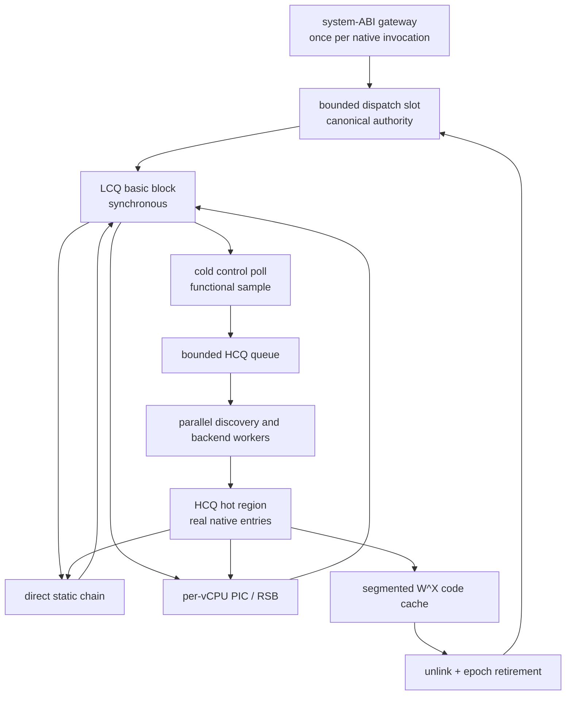

# Nixe tiered JIT architecture

## Status and authority

This is a living specification of the intended design, governed by
[CONTRIBUTING.md](../../../CONTRIBUTING.md). Update the affected sections when
agreed architectural decisions, contracts or task scope change during
implementation. Replace obsolete text rather than appending a changelog; Git
preserves the history. Internal implementation details need not be documented
unless they affect those contracts. The code remains the source of truth for
current behavior: a requirement written here is not evidence of implementation
or verification.

This document is the sole normative specification and implementation sequence
for Nixe's in-memory JIT architecture. Other documents may link to it, but they
neither schedule nor constrain its design, work order or acceptance criteria.
References to the current source tree describe migration input, not immutable
architecture.

The implementation may replace crate boundaries, runtime data structures,
Cranelift integration, generated-code ABI, executable allocation, dispatch,
linking, tier selection and invalidation. If a requirement proves technically
impracticable, implementation stops and this specification is amended before a
different architecture is built. A compatibility implementation is not an
acceptable substitute.

The architecture is complete only after the superseded implementation and its
adapters, branches, abstractions and tests have been removed. Green tests for
the old architecture are not an acceptance criterion.

## Objective

The target is a correct, highly efficient JIT for commercial Nintendo Switch
software, with first-use latency and sustained execution competitive with the
best production emulators on x86-64 and AArch64. The priorities, in order, are:

1. Preserve exact guest semantics, native-fault retry, invalidation and FP
   state.
2. Minimize sustained hot-path work: guest branches should remain native,
   ordinary RAM accesses should remain ordinary host accesses, and compatible
   links should avoid the dispatcher and full architectural-state round trips.
3. Keep synchronous first-use compilation small and predictable.
4. Spend higher-quality compilation only on execution-proven hot code, without
   delaying the guest.
5. Bound and reclaim executable code and all metadata that shares its
   lifetime.
6. Retain only complexity which buys correctness or measurable execution,
   compilation or cache benefit.

Simplicity means removing accidental complexity. It does not mean preserving a
slower ABI, an append-only allocator or an inferior compiler boundary because
those are easier to implement.

## Scope and non-goals

This specification owns:

- the LCQ and HCQ unit shapes;
- the native gateway and fast-chain ABI;
- static linking, indirect dispatch and return prediction;
- functional hot-code selection;
- background compilation and duplicate-work arbitration;
- publication, version replacement and overlap policy;
- executable allocation, W^X, invalidation, retirement and reclamation;
- exact code/fault/dependency lifetime;
- x86-64 and AArch64 conformance; and
- migration and deletion of the superseded implementation.

The following are not part of this architecture:

- a persistent on-disk native-code cache;
- speculative value profiling, guards, deoptimization or trace trees;
- a title-specific policy database;
- an interpreter fallback hidden behind a JIT miss or compilation failure;
- exact retired-instruction observability;
- production compilation timers, overlap statistics, counters exported for
  diagnostics, benchmark modes or other unsolicited telemetry.

Tier-selection samples are functional compiler state, not observability. They
exist only to decide whether and what to compile, are updated only at an
already-required control poll, and are never logged or exposed.

## Supported baseline

The required native hosts are `x86_64-unknown-linux-gnu` using SysV and
`aarch64-unknown-linux-gnu` using AAPCS64. A different OS/ABI becomes supported
only after this document is extended with its gateway registers, executable
memory policy, fault transport, instruction-cache synchronization and native
conformance run; it is not accepted through a generic fallback.

Task 1 records its source commit and the exhaustive set of NormalizedA64
variants accepted by the production JIT in a checked-in conformance manifest.
Both LCQ and HCQ must support that immutable baseline. Later instruction
coverage additions update the manifest only when both tiers and both native
hosts pass the same semantic/fault tests. An implementer cannot narrow
"supported instructions" to make an acceptance run pass.

### Wasmtime fork and working branch

The upstream base is the stable Wasmtime release `v48.0.1`, commit
`7bac2c2775808aaec5d4aa5627a5e447b51102cf`, containing Cranelift `0.135.1`.
Use this release as the starting point, not a development snapshot.

The fork is `https://github.com/pladaria/wasmtime`. Backend development takes
place in `/home/pladaria/projects/wasmtime` on branch `nixe`, already created
from that commit. Inspect the local source there when checking Cranelift APIs.
Continue work on this branch; do not recreate it or reset it to the release
commit as changes accumulate. On another machine, use a clone of the same fork
and its `nixe` branch; the local path is not a build dependency.

The release commit identifies the upstream base; the tested commit on `nixe`
identifies the evolving Nixe backend. Pin Nixe's Cargo dependencies to that exact
fork commit using `rev`, and update `Cargo.lock` with dependency changes. Do
not use a floating branch dependency or commit a machine-local path override.
The backend changes required by Task 1 are made in this fork.

See [Cranelift modifications](../../cranelift-modifications.md) for the
implemented fork changes, their motivation and their benefits to Nixe.

## Evidence from reference engines

The architecture deliberately combines two proven families instead of copying
one engine wholesale.

Ryujinx ARMeilleure separates fast low-quality compilation from higher-quality
background recompilation. It uses roughly 500 instructions for low quality,
2500 for high quality and requests retranslation after about 100 entry calls.
Its exact-root multi-block cache can retain overlapping functions, so its
constants do not by themselves solve Nixe's overlap problem. See the pinned
[decoder](https://git.axenov.dev/Museum/ryujinx/src/commit/a0624de3fdaa125d51187f90069c7150219b3b55/src/ARMeilleure/Decoders/Decoder.cs),
[translator](https://git.axenov.dev/Museum/ryujinx/src/commit/a0624de3fdaa125d51187f90069c7150219b3b55/src/ARMeilleure/Translation/Translator.cs)
and
[translation cache](https://git.axenov.dev/Museum/ryujinx/src/commit/a0624de3fdaa125d51187f90069c7150219b3b55/src/ARMeilleure/Translation/TranslatorCache.cs).

FEX uses multi-block compilation with selected public entries and preserves
post-call continuations without making every internal block public. It permits
cheap duplicate frontend work in a race, then rechecks before expensive
backend work. Its 5000-instruction default explicitly carries a compilation
stutter warning, so that number is not copied. See the pinned
[multiblock frontend](https://github.com/FEX-Emu/FEX/blob/511c45c4c63ae2958027ca7bfdb88cea457afceb/FEXCore/Source/Interface/Core/Frontend.cpp#L1137-L1220),
[entry emission](https://github.com/FEX-Emu/FEX/blob/511c45c4c63ae2958027ca7bfdb88cea457afceb/FEXCore/Source/Interface/Core/JIT/JIT.cpp#L930-L978),
[race recheck](https://github.com/FEX-Emu/FEX/blob/511c45c4c63ae2958027ca7bfdb88cea457afceb/FEXCore/Source/Interface/Core/Core.cpp#L779-L829)
and
[configuration](https://github.com/FEX-Emu/FEX/blob/511c45c4c63ae2958027ca7bfdb88cea457afceb/FEXCore/Source/Interface/Config/Config.json.in).

QEMU normally translates single-entry TBs with a general ceiling of 512 guest
instructions, then avoids dispatcher round trips through direct block
chaining. It accepts rare differently rooted overlap because units are small
and its code buffer is reclaimable. See the pinned
[TB bound](https://github.com/qemu/qemu/blob/93b9a2436564a9df25a0b978c8245fed255264f2/include/exec/translation-block.h#L75-L88),
[direct-chaining design](https://github.com/qemu/qemu/blob/93b9a2436564a9df25a0b978c8245fed255264f2/docs/devel/tcg.rst#L33-L125)
and
[concurrent publication](https://github.com/qemu/qemu/blob/93b9a2436564a9df25a0b978c8245fed255264f2/accel/tcg/translate-all.c#L524-L539).

Dynarmic/Yuzu uses exact LocationDescriptor blocks, direct LinkBlock patching,
fast dispatch and a return-stack hint. Dolphin likewise compiles exact
root/state blocks, directly links them and follows only a shallow bounded
branch shape. Their small units are successful because their dispatch and
cross-block boundary are designed to be cheap. See Dynarmic's
[design](https://github.com/Borked3DS/dynarmic/blob/bd287ce645117040abb393357f82fa55e7a16242/docs/Design.md),
[A64 translator](https://github.com/Borked3DS/dynarmic/blob/bd287ce645117040abb393357f82fa55e7a16242/src/dynarmic/frontend/A64/translate/a64_translate.cpp)
and
[A64 linker](https://github.com/Borked3DS/dynarmic/blob/bd287ce645117040abb393357f82fa55e7a16242/src/dynarmic/backend/arm64/address_space.cpp),
and Dolphin's
[analyzer](https://github.com/dolphin-emu/dolphin/blob/a1e636d72c8469acf747ac6542f0b7ace7cea02f/Source/Core/Core/PowerPC/PPCAnalyst.cpp#L806-L985)
and
[block cache](https://github.com/dolphin-emu/dolphin/blob/a1e636d72c8469acf747ac6542f0b7ace7cea02f/Source/Core/Core/PowerPC/JitCommon/JitCache.cpp).

These references support the chosen hybrid:

- LCQ uses small canonical basic blocks and cheap native chaining.
- HCQ uses execution-informed multi-block regions to recover cross-block SSA
  and higher-quality allocation.
- A bounded cache and versioned replacement make temporary code duplication
  recoverable.
- Exact-key deduplication and a short pre-backend reservation prevent duplicate
  expensive compilation without serializing all discovery.
- A classic linear trace JIT is rejected. Its duplicated tails, side-exit
  proliferation, edge instrumentation and deoptimization surface are not
  justified for already-compiled A64 software.

## Architecture overview



The gateway establishes fast mode once. A native invocation may traverse many
LCQ and HCQ units without returning to Rust. Static links normally become
direct branches. Dynamic branches and returns use per-vCPU native caches.
Only a control-budget expiry, miss requiring compilation, architectural
boundary, unrecoverable fault or explicit runtime request leaves fast mode.

## Architectural invariants

1. One guest architectural semantics implementation feeds both tiers.
2. Each complete BlockKey has one current dispatch identity. Dispatch records
   are bounded and reclaimable; guest PC alone is never an identity.
3. The dispatch table is the authority and fallback; it is not a mandatory
   load on every resolved static edge.
4. Ordinary compatible cross-unit edges execute without Rust, a global lookup,
   a full A64State commit/reload, a system-ABI call or a native
   prologue/epilogue.
5. LCQ is always sufficient for correct progress. HCQ is never waited for by a
   vCPU and never becomes a semantic fallback.
6. An active guest InstructionKey belongs to at most one HCQ family. LCQ may
   overlap it. Consecutive HCQ versions may coexist only while incoming roots
   are being cut over and the old version remains epoch-protected.
7. Generated code never queries HCQ ownership, code-cache capacity or
   dependency indexes.
8. Fast mapped RAM relies on the host mapping/protection contract defined here.
   No duplicate guest permission or ownership lookup is added to a normal
   memory access.
9. Code bytes, link bridges, dependency records, state maps and native-fault
   metadata share a versioned lifetime and cannot be reclaimed separately.
10. Unsupported guest semantics stop precisely. They do not silently enter the
    interpreter or an obsolete JIT.

## Policy defaults and safety bounds

These are explicit initial production constants. They are policy rather than
semantic invariants, but the implementation contains one value for each and no
runtime tuner or title override.

| Policy                                                 |                                                                      Value |
| ------------------------------------------------------ | -------------------------------------------------------------------------: |
| LCQ unit                                               |                                                    one natural basic block |
| LCQ hard safety ceiling                                |                                                     512 guest instructions |
| HCQ total instruction ceiling                          |                                             2048 unique guest instructions |
| control/tier sample interval                           |                                        4096 approximate guest instructions |
| samples required for an HCQ seed                       |                                                                          8 |
| sampled cross-owner edges required for reshape         |                                                                          4 |
| hot-seed storage                                       |                                                 256 sets x 4 ways per vCPU |
| sampled successors retained per seed                   |                                                                          4 |
| boundary storage                                       |                                                  64 sets x 2 ways per vCPU |
| HCQ worker count                                       | 0 when logical_cpus <= 2; otherwise min(4, max(1, (logical_cpus - 2) / 2)) |
| pending HCQ capacity                                   |                                                           8 x worker count |
| pending selection                                      |                                     seven newest jobs, then one oldest job |
| indirect dispatch cache                                |                                                2048 sets x 2 ways per vCPU |
| dynamic-bridge weak-index and strong-reference ceiling |                                                   4096 x active vCPU count |
| software return-stack size                             |                                                16 entries per guest thread |
| virtual executable reservation                         |                                                                   2047 MiB |
| executable segment size                                |                                                                     16 MiB |
| link-island reservation per segment                    |                                                                     64 KiB |
| committed code+metadata soft limit                     |                                                                    512 MiB |
| committed code+metadata hard limit                     |                                                                    640 MiB |
| LCQ emergency reserve                                  |                                                                     32 MiB |
| LCQ compiler policy                                    |                                                opt_level=none, single_pass |
| HCQ compiler policy                                    |                                              opt_level=speed, backtracking |

The 512 LCQ ceiling is an emergency bound, not a request to build a 512
instruction CFG. A normal LCQ block stops at its first terminator and is
usually much smaller. The 2048 HCQ limit is a total across the complete
candidate; it is never reset per path, entry or continuation. Code-page and
mapping dependencies are collected completely and do not impose independent
discovery limits.

## Direct memory and fault authority

The supported Linux hosts reserve one flat, guarded virtual arena per guest
address space. Guest mappings and permissions are represented by host mappings
and page protections; that representation is the sole authority on a normal
CPU access. Reverse physical aliases and the dependency index are cold
transition data, not generated-access lookup structures.

The native ABI pins the arena base in `r13` on x86-64 and `x19` on AArch64.
After the architecturally required guest-address calculation, an eligible RAM
operation contains only the minimum confinement needed to prevent an arbitrary
guest value escaping the reserved arena, base addition and the native
load/store/atomic. HCQ may eliminate or hoist redundant confinement when its
proof covers every path. There is no generated page-table, permission,
observer, backing-kind or ownership lookup and no eager architectural-state
checkpoint.

An arena host fault is classified by the immutable native-PC record and the
memory authority's current mapping generation:

- a valid tracked/reconciliation RAM protection transitions once to its
  writable/current state and retries the identical native instruction;
- a valid emulated non-RAM access reconstructs the prefault guest state,
  performs one typed cold operation and resumes after that guest instruction;
- an unmapped or permission-invalid guest access reconstructs the exact
  architectural data fault; and
- an address outside the arena, unattributed host PC, nested resolver fault or
  impossible mapping state is a precise internal failure.

Mapping, permission, alias and tracking changes use the Closed transition
defined below before host mappings become visible. The direct interpreter uses
fixed native stubs registered in the same native-PC directory and follows the
same classification/retry rules. A checked backend is a separately selected
process backend for unsupported hosts and differential tests; it is never a
per-access or per-instruction fallback from this JIT.

Instruction fetch/copy is performed through a versioned executable-content
snapshot which returns the exact bytes, physical/mapping dependencies and
cursor used for publication revalidation. A compiler never reads live guest
memory after releasing that snapshot.

## Runtime data model

### Keys and dispatch publication

BlockKey contains every value which can change generated semantics:

- address-space identity;
- guest PC;
- execution/profile identity;
- target platform;
- FP-mode specialization when native lowering depends on it; and
- any backend-visible architectural mode added later.

Mapping and code generations are not hidden in the key. They are explicit
version checks. InstructionKey is the same semantic identity with an exact
four-byte A64 instruction PC; HCQ overlap is arbitrated over InstructionKeys,
not block roots or address hulls.

The bounded dispatch index maps BlockKey to a generational DispatchSlot. The
slot release-publishes one immutable DispatchPayload containing:

- a globally unique ReachabilityVersion;
- the current LCQ entry, when resident;
- the preferred entry, which is the current HCQ entry when one exists and the
  LCQ entry otherwise; and
- the current HCQ family/version identity, when present.

A reader publishes its execution epoch before it looks up a slot, then
acquire-loads the complete payload. Entry address, code version and
ReachabilityVersion are therefore one coherent publication. The slot and its
payload are not embedded in resolved static links.

DispatchSlot addresses are not process-lifetime ABI. Source fallbacks embed a
BlockKey and resolve it again; queued work carries keys and generational
handles. A slot is removed and epoch-retired when it has no resident entry,
compile/reservation state or queued job. A fallback does not pin a slot. This
prevents dynamic code and self-modifying workloads from growing an unbounded
node arena. Tier heat lives only in the fixed per-vCPU tables and generated
code never loads it.

### Code units and versions

Every native allocation has a nonzero, monotonically assigned CodeUnitId and a
non-reused CodeVersion. ReachabilityVersion, CodeUnitId, CodeVersion,
HcqFamilyId, family version, segment generation, execution epoch, admission
epoch and maintenance request sequence are checked u64 counters. They never
wrap: exhaustion disables HCQ and produces a precise capacity failure on the
next operation that requires new LCQ publication or lifecycle transition.

Reserve the unit identity and captured admission epoch before emitting native
exits that embed its CodeVersion. Publication consumes that identity unchanged;
it must not relabel state maps after emission or accept code from an older
admission epoch. Abandoned emission identities are never reused.

An immutable CodeUnit owns:

- tier and backend ABI version;
- exact BlockKeys and InstructionKeys;
- canonical and fast native entry offsets;
- entry live-in contracts and exit dirty/live-out maps;
- exact copied instruction image;
- mapping and physical code dependencies;
- relocations, direct-link patch sites and source-local fallbacks;
- native-fault records;
- executable allocation and segment identity; and
- publication and retirement epochs.

An HcqFamily owns the active optimized InstructionKeys and current CodeVersion.
A successor may replace one or two adjacent families as one transaction. Old
versions remain callable until every dispatch/PIC/direct-link root has been
cut over; only then are they epoch-retired.

Each CodeUnit follows exactly:

```text
Staging -> Published -> Superseded|Invalidating -> Unlinked
        -> Retired(retirement_epoch) -> Reclaimed
```

`Staging` is unreachable. `Published` may acquire roots. Superseding first
publishes replacement dispatch payloads and registers the cutover; invalidating
first closes process admission. `Unlinked` means no future gateway, dispatch,
static patch or PIC can enter the unit. An RSB contains only a guest BlockKey
and cannot enter code by itself. Retirement records the epoch but
does not remove fault/dependency metadata. Reclamation alone returns registry
slots and executable spans. State transitions compare CodeUnitId,
CodeVersion and admission epoch so a stale task cannot advance a newer unit.

### Bounded registries and indexes

The runtime has the following authorities; none is append-only:

- the dispatch index maps BlockKey to generational DispatchSlot;
- the unit and family registries map generational handles to strong CodeUnit
  and HcqFamily references;
- the dependency index maps each physical/mapping page identity to every live
  or retired-but-callable CodeUnit which depends on it;
- the HCQ owner index maps each active or reserved InstructionKey to its exact
  family/build generation;
- the link graph stores incoming roots and outgoing patch records by source and
  target CodeVersion; and
- the native-PC directory derives a segment slot from the fault address and
  acquire-loads that segment generation's immutable sorted fault table.

The native-PC directory has 128 fixed slots: 127 full 16 MiB segments and one
final 15 MiB segment in the 2047 MiB executable reservation. It is safe for
bounded signal-time lookup and does not allocate or lock. All other indexes are
cold-path structures and are never consulted by ordinary generated RAM
operations or resolved static links.

Registries use reusable generational slabs. A queued compiler/link job owns a
strong reference to every CodeUnit snapshot it reads. Removal from an index
does not free an object until vCPU execution epochs, compiler references, link
jobs and fault dispatchers have all released it. Metadata bytes and occupied
slots count against the same cache budget as their CodeUnit; empty slots are
reused. There is no permanent range partition, process-lifetime node pool or
second executable lookup table.

## Native fast-chain ABI

The x86-64 ABI requires LAHF/SAHF in 64-bit mode, as documented in
[host requirements](../../host-requirements.md). Check CPUID support during JIT
process initialization, not in invocations or links. Unsupported hosts fail
initialization; no alternate flag ABI is maintained for them. SAHF installs
SF/ZF/CF from packed guest NZCV; establish OF separately and preserve borrowed
RAX in the fixed transfer area. This conversion does not use the host stack.

### Gateway and fast mode

The system-ABI gateway is entered once per native invocation. It:

1. saves the caller host FP environment and every nonvolatile register reserved
   by the JIT;
2. establishes NativeFrame and publishes the vCPU's active execution epoch;
3. checks the process admission/control epoch;
4. resolves the initial BlockKey and acquire-loads its coherent
   DispatchPayload while protected by that execution epoch;
5. revalidates the process admission epoch and ReachabilityVersion after the
   lookup, leaving canonically if either changed;
6. pins NativeFrame, the direct-arena base and the current poll deadline while
   retaining both budget balances in NativeFrame;
7. lazily activates the guest FP environment; and
8. jumps to the selected canonical entry.

No executable or entry address is read before the execution epoch is active.
This ordering closes the lookup-to-entry retirement race; an epoch is cleared
only after all state needed by a canonical exit has been written.

The initial ABI variants reserve:

| Role                    | x86-64 | AArch64 |
| ----------------------- | ------ | ------- |
| NativeFrame pointer     | r15    | x21     |
| remaining poll budget   | r14    | x20     |
| direct guest-arena base | r13    | x19     |
| link scratch            | r11    | x16/x17 |

The context, arena and poll registers are pinned and saved/restored once by the
gateway. Link scratch registers are globally unavailable to register
allocation; no EntryContract or ExitStateMap may place a guest value in them.
Generated guest units do not adjust the host stack, execute ret, or grow a host
call chain when following guest branches, calls or returns.

NativeFrame contains a 16 KiB, 64-byte-aligned fixed spill area shared by the
chain for one vCPU invocation. The first 2 KiB are ABI-owned transfer space for
cycle-breaking, helper saves and fault escape; the remaining 14 KiB are the
backend spill arena. The backend addresses every spill relative to the pinned
NativeFrame register, never SP. It reports its maximum extent before
publication. A unit which exceeds its arena must be split; it may not grow the
host stack, allocate an unbounded frame or silently select another ABI. Normal
system-ABI helper calls use the gateway's correctly aligned host stack and
cannot overlap NativeFrame storage.

Stock Cranelift exposes only one pinned register and does not provide
prologue-free multi-entry blocks, link patchpoints or semantic block-label
offsets. The implementation therefore uses a maintained fork of the
pinned Cranelift revision rather than weakening this ABI. If the Task 1 proof
shows that the required hooks cannot be maintained without replacing
Cranelift's allocator or machine backend, implementation stops and this
specification is amended with the concrete replacement; the implementer does
not choose an undocumented fallback. The patch is limited to:

- reserving the context, arena and poll registers plus every link-scratch
  register;
- redirecting register-allocator spills and stack-slot references to the fixed
  NativeFrame spill arena, with exact maximum-extent reporting;
- emitting prologue-free fast entries and source-local patchpoints;
- exporting selected final block-label offsets;
- accepting physical EntryContracts and exporting final ExitStateMaps at link,
  helper, control and fault boundaries;
- returning final relocation and fault-site data to Nixe's allocator; and
- selecting jump-appropriate BTI/CET landing pads.

Bridge and helper veneers use the permanently reserved scratch registers and
the ABI-owned transfer slots. They never borrow an allocator-visible register
without first moving its mapped guest value according to the source state map.

It must not fork instruction semantics, add a second IR or turn every guest
instruction into a custom lowering rule.

### State transfer

Canonical A64State remains the architectural authority outside native
execution. Within a unit, guest values remain in SSA/native registers. At an
external edge:

- the source stores only dirty values proven live-out;
- values proven overwritten before any read or observation are discarded;
- the target canonical adapter loads only true live-ins;
- PC is not stored on an ordinary known static link;
- lazy NZCV is preserved when the bridge is flag-transparent, otherwise only
  the required bits are materialized;
- the active guest FP environment remains active; and
- no entry safepoint is repeated.

Use/def, partial-write, live-in and live-out analysis has one implementation
shared by LCQ entry formation, HCQ entry formation, dirty commits and helper
boundaries. A test-only alternate classifier is forbidden.

Each published guest PC has two entry contracts:

- canonical ingress reads its true live-ins from current A64State and is used
  by the gateway and a compile/link miss; and
- fast ingress names physical registers or fixed NativeFrame slots and is used
  by a static or dynamic source whose bridge was built for that exact source
  ExitStateMap, target contract and pair of CodeVersions.

Each external exit publishes an ExitStateMap with the physical location of
every dirty live-out plus lazy NZCV/FPSR state. These maps come from final
register allocation; undocumented compiler SSA is never the sole owner of a
value at a link, helper, control poll or fault boundary.

Static and dynamic link bridges perform cycle-safe parallel copies and use the
fixed transfer slots when source and target physical locations differ. A
compatible static edge whose source locations already satisfy the target fast
contract has an empty bridge followed by one direct branch.

An indirect branch probes with an ExitSiteKey containing its source
CodeVersion and exact ExitStateMap identity. A PIC hit jumps to the immutable
bridge compiled for that site and target fast-entry contract. It does not
commit A64State, leave the execution epoch or interpret a register-move plan.
Only a PIC miss canonicalizes the dirty state before its cold resolver. Dynamic
BridgeUnits are bounded by the number of live PIC ways, deduplicated weakly and
retired through the same epoch/cache lifecycle as normal code.

The ABI does not promise that all 31 GPRs and 32 vectors remain permanently
assigned to host registers across independently allocated LCQ blocks; HCQ
provides broad cross-block SSA where that matters.

Poll arithmetic, confinement, PIC/RSB comparisons, bridge copies and every
other JIT-infrastructure instruction participate in the same liveness model.
If one would clobber host flags holding a live lazy guest NZCV producer, the
compiler must schedule it after the producer's final consumer, use a
flag-transparent form, or preserve/materialize the exact required guest flags
first. Infrastructure may never silently destroy architectural flags. This is
paid only when such a producer is live, not as an unconditional NZCV store at
each boundary.

### Helpers and architectural boundaries

Helpers have typed signatures and explicit state effects. A helper veneer saves
only live caller-clobbered values. Pure supported integer, branch, memory and
SIMD operations do not use a generic helper.

A stateful runtime helper, SVC, FP-mode write, unsupported instruction,
scheduler request or nonretry fault canonicalizes exactly the state it can
observe and leaves fast mode. A successful typed helper reloads only the
continuation live-ins.

Guest FPCR/FPSR and host FP ownership retain one implementation for both tiers:

- the caller FP environment is saved once at gateway entry;
- a compatible guest FP segment remains active across native links;
- sticky host/software status is materialized only when observed, replaced or
  leaving fast mode;
- FPCR/FPSR writes end the current segment with exact ordering; and
- a general Rust helper suspends the guest FP segment and restores it only on a
  successful continuation.

### Control budget and functional sampling

Exact instruction observability is not part of the production JIT. Each vCPU
persists an approximate `sample_remaining`; each native invocation adds its
runtime `slice_remaining`. NativeFrame stores both plus `armed_span`, while the
pinned register carries their next positive minimum. Generated code therefore
pays for one counter and one not-taken deadline branch, not two budgets:

```text
gateway:
  if slice_remaining <= 0: canonical BudgetExhausted
  armed_span = min(sample_remaining, slice_remaining)
  poll_remaining = armed_span

generated block checkpoint:
  poll_remaining -= static instructions completed on this path
  if poll_remaining <= 0: cold_poll(source, destination, edge_kind)

cold_poll or any canonical exit:
  spent = armed_span - poll_remaining
  sample_remaining -= spent
  slice_remaining -= spent
  if sample_remaining <= 0:
      emit one functional sample unless this is a forced control transition
      do sample_remaining += 4096 while sample_remaining <= 0
  process control/invalidation
  if slice_remaining <= 0 or control requires exit: canonical scheduler exit
  armed_span = min(sample_remaining, slice_remaining)
  poll_remaining = armed_span
  resume through the source continuation
```

Every LCQ fragment performs the subtraction/check immediately before its
terminal transfer. HCQ carries the counter in SSA, subtracts the executed
canonical block cost and checks at every backedge and external exit; an acyclic
forward path is bounded by the 2048-instruction unit ceiling. Negative
`poll_remaining` carries block overshoot into both balances and the repeated
addition preserves it across sample intervals. A forced transition discards a
crossed heat sample but still charges the approximate runtime slice. Any other
canonical exit commits the partial `spent` value before clearing the execution
epoch.

The cold control path records the actual source BlockKey, destination guest PC
and edge kind, then either resumes or returns to the scheduler according to the
runtime-slice decision above. This reuses a required control boundary; it adds
no dispatch-slot load/store, atomic RMW or promotion branch to the normal link
path.

Each vCPU owns one HotSeedTable of exactly 256 sets by four ways. It is updated
non-atomically only by that vCPU's cold poll; process migration cannot corrupt
it and may only delay promotion. A record contains full BlockKey,
ReachabilityVersion, a u8 score saturating at eight, a checked u64 last-sample
sequence, the last destination and edge kind, and four observed successor
slots. Lookup compares the full key. An empty way is used first; otherwise it
replaces the lowest score, then oldest sequence, then lowest way. A matching
sample increments the score. Reaching eight attempts one HCQ admission. Queue
contention or fullness keeps score seven so the next real sample retries.
Invalidation resets matching records.

A successor slot records both static and dynamic observations as full target
BlockKey, u8 count saturating at 255 and checked u64 last-sample sequence. A
matching target increments its count; a miss uses an empty slot or replaces the
lowest count, then oldest sequence, then lowest slot. When a seed is admitted,
its key/version, last destination and four successor slots are copied into the
preallocated queue cell as an immutable AdmissionSnapshot. A worker never
reads another vCPU's HotSeedTable.

Each vCPU also owns a 64-set, two-way BoundaryTable. Its full key is source
InstructionKey, target InstructionKey, source family/version and optional
target family/version. Its u8 score saturates at four and uses the same
empty/lowest-score/oldest-sequence/lowest-way replacement rule. Four samples
copy an immutable ReshapeSnapshot into a queue cell. Queue contention keeps the
score at three. This table covers HCQ-to-LCQ, HCQ-to-HCQ and a retained-LCQ
entry into an HCQ-owned instruction; it is the only late-entry/reshape counter.

Sample-sequence overflow has no semantic meaning. At u64::MAX, the owning vCPU
clears both bounded tables at the same cold poll and restarts its sequence at
one. Identity/version counters never use this reset rule. On a host configured
with zero HCQ workers, scores may saturate but admission is disabled and no
queue is allocated.

No timer, log, report, histogram or public API exposes this state.

## LCQ baseline compiler

An LCQ unit is one single-entry straight-line fragment representing a naturally
reached basic block, except that the emergency ceiling may split an unusually
long block:

- it starts at the demanded BlockKey;
- it ends after the first direct branch, conditional branch, call, indirect
  branch, return, SVC, BRK, FP-mode boundary, unsupported instruction or
  architectural exit;
- a straight-line block is cut after 512 instructions and continues through an
  ordinary static link;
- it decodes no successor speculatively; and
- it retains every exact dependency read while decoding that block.

The requesting vCPU compiles LCQ synchronously with opt_level=none and
single_pass register allocation. An exact-key state CAS allows one compiler for
that generation. A competing vCPU may wait only for the same BlockKey
publication; unrelated LCQ compilation uses vCPU-local compiler state and
continues concurrently.

LCQ never invokes HCQ discovery, a CFG breadth-first search or a function
scanner. Rare overlap caused by an indirect entry into the middle of an
existing LCQ block is accepted because the units are small, versioned and
reclaimable. Both units are indexed for invalidation.

## Static and dynamic linking

### Static links

Every external static edge initially branches to a source-local fallback
thunk. The thunk resolves the target BlockKey through the dispatch index or
exits to compile that exact key. Before lookup it uses the source ExitStateMap
to canonicalize dirty state; an already-published target resumes through its
canonical ingress, while a miss leaves through the ordinary compile exit. This
traffic is confined to the unlinked fallback. Once source and target contracts
are compatible, the linker creates the minimal source-owned bridge and marks
the edge for a direct patch.

A source compiled while its target is already valid is linked before the
source becomes executable. Changing already-published code uses the shared
control-poll word to request a process-local JIT maintenance rendezvous. HCQ
publication, replacement and unlink requests may share one pending rendezvous;
they never add another generated-code check. Until the rendezvous, old and
fallback targets remain callable and epoch-live.

Each patch record owns an intrusive pending-state bit and a generational list
handle. The bounded pending set contains at most one handle per live patch
record and has no separately allocated job object. Publication records the
patch/backlink and its pending state under the JIT-state mutex before any new
DispatchPayload becomes reachable. At rendezvous, the linker revalidates both
source CodeVersion and target ReachabilityVersion immediately before changing
bytes. A stale record is detached without patching. Invalidation and cache
pressure force completion of every safety-critical unlink before execution
reopens; performance-only new links may be processed in batches of 4096 and
remain on their correct fallback until the next rendezvous.

Patch shapes are fixed:

- x86-64 uses an eight-byte-aligned eight-byte patch unit containing jmp rel32
  plus padding; and
- AArch64 uses one aligned b imm26.

A compatible in-range edge with an empty transfer bridge is exactly this one
patched branch after the guest branch decision. An edge needing register moves
branches to a source-owned bridge and then to the target. AArch64 sources
outside direct range branch to a local 16-byte island which loads an
epoch-managed target and executes br; x86-64 uses the equivalent island only
when rel32 cannot reach. These are distinct accepted shapes and are not called
single-branch links.

Each 16 MiB segment reserves its final 64 KiB for link/helper islands. A
CodeUnit preflights one fixed island slot for every static exit which could need
one plus the exact helper veneer bytes before final allocation. Dynamic targets
never allocate islands. If the segment cannot reserve the complete worst-case
set, the allocator tries another segment or splits the unpublished unit. It
never publishes a unit whose island demand can overflow later.

Every patch record names source CodeVersion, target BlockKey,
ReachabilityVersion and CodeVersion, source state map, target entry contract,
patch address, bridge/fallback and target backlink. Invalidation can therefore
unlink without scanning unrelated code.

### Indirect dispatch cache

Each vCPU owns a 2048-set, two-way cache in writable nonexecutable memory. A
record contains the full ExitSiteKey, target BlockKey, target
ReachabilityVersion/CodeVersion and a generational strong handle plus address
for the exact BridgeUnit. Generated BR/BLR:

1. computes the guest target;
2. preserves any lazy guest flags which its scratch-only probe would destroy;
3. probes both ways using the full source-site and target key;
4. jumps to the matching bridge on a valid hit; and
5. canonicalizes dirty state and enters the resolver on a miss.

The cache is private to the vCPU, so hits need no atomic operation, shared
generation load or recency write. The cold resolver alternates replacement
ways and resolves or builds a BridgeUnit from the exact source ExitStateMap and
target fast contract. A fixed-capacity process-wide weak generational table,
with 4096 slots per active vCPU and round-robin collision replacement,
deduplicates an identical bridge key but never keeps a bridge alive. Each
occupied PIC way owns one strong reference; replacing/clearing the way releases
it. Consequently neither the weak index nor strong BridgeUnits can exceed 4096
times the active-vCPU count, regardless of target churn. A stale weak entry is
removed on lookup.

Publication may leave an old cache entry usable only while its source, bridge
and target versions stay callable. The mandatory maintenance rendezvous clears
entries which name a superseded/invalidated source or target before any of
those objects is retired; eviction cannot reclaim them sooner. Dynamic bridges
are ordinary allocator spans and never consume static link-island slots.

Guest values are never treated as host pointers.

### Software return stack

Each guest thread owns a 16-entry circular software return stack which follows
that thread across host-vCPU migration and is never executed concurrently.
Every entry contains the full continuation BlockKey. The stack stores a
four-bit head and a five-bit depth. BL/BLR pushes after updating architectural
X30; overflow overwrites the oldest entry and keeps depth at sixteen.

RET first computes the architectural target and compares it with the top full
BlockKey. On a match it pops and probes the ordinary per-vCPU PIC using that
RET's ExitSiteKey; a hit reaches the exact return bridge without canonical
state traffic. An unresolved match, mismatch or underflow uses the ordinary
indirect miss resolver; mismatch/underflow also clears the unreliable
prediction chain. The RSB contains no host code pointer and does not keep code
alive. Clearing affected PIC ways at maintenance is sufficient for bridge and
target reclamation.

The structure is only a prediction. It never changes X30 semantics or bypasses
target validation. Guest calls and returns use jumps, not the host return
stack.

### Branch-target protection

With AArch64 BTI enabled, every target reached through br has bti j, and a
target reached both by call and jump has bti jc. Direct-only private labels need
no landing instruction. With x86 CET/IBT enabled, every possible indirect
target begins with ENDBR64. The backend exports real selected label offsets;
there is no ordinal veneer or common br_table entry dispatcher.

## HCQ selection and region formation

### Admission

A cold sample which raises an uncovered seed to score eight first CAS-reserves
the exact BlockKey/ReachabilityVersion as AdmissionReserved(token). It then
try-locks the pending container. On contention or fullness it CAS-rolls back
that exact token to Idle and leaves the score at seven; if invalidation already
replaced the token, its stale cleanup owns the state. With a reserved queue
cell, admission writes the complete AdmissionSnapshot, release-changes the
state to HcqQueued(token), pushes while still holding the queue lock and then
unlocks. A worker cannot observe a queue cell before HcqQueued. Guest execution
continues through LCQ throughout this cold operation.

The pending container is a preallocated VecDeque of exactly eight requests per
worker. Guest admission uses try_lock and never allocates or waits. Workers take
seven jobs from the back, then one from the front, repeating that cycle; this
retains recency without indefinite starvation. The compile-state entry is the
sole request deduplication mechanism and is reclaimed with its dispatch slot.

Worker count is selected once from the policy formula. Each worker owns its
decoder scratch, Cranelift context and register allocator. There is no shared
compiler mutex, task-per-thread spawning or general runtime thread pool.
With zero workers HCQ is disabled and no pending container exists.

After dequeue, a worker enters compiler read-side protection. Discovery is
incremental: when the bounded worklist names a BlockKey, the worker briefly
uses the corresponding dispatch-index shard to validate the captured admission
epoch and clone that LCQ CodeUnit's strong immutable reference, then releases
the shard before decoding it. It scans neither the registry nor all resident
LCQ units and holds at most the candidate's 2048 InstructionKeys worth of
references. A job never reads a per-vCPU profile table or a raw registry
pointer. Eviction/invalidation may remove units from indexes but cannot reclaim
their instruction images or metadata until every worker reference is dropped.

### Execution-informed graph

HCQ is a non-speculative region over demand-proven LCQ blocks. A block is
eligible only when:

- its exact LCQ was published and therefore actually demanded;
- its ReachabilityVersion and mapping generations still match;
- it has the same execution key as the seed; and
- it is not reserved by an unrelated HCQ build.

The worker explores its immutable snapshots without a shared planner lock. The
deterministic worklist orders candidates by:

1. the seed;
2. mandatory reshape endpoints, ordered by BlockKey;
3. the admitted seed's observed successors by descending u8 count, then newer
   AdmissionSnapshot sequence, then ascending BlockKey;
4. an unconditional direct successor;
5. conditional fallthrough, then conditional taken; and
6. ascending BlockKey as the final tie-break.

Unconditional and conditional successors are considered only if their exact
LCQ is already published. Sampled successors come only from the immutable
AdmissionSnapshot; no worker consults live heat state. Calls and callees remain
external. A return continuation is an
independent LCQ/HCQ seed; it is not pulled in merely to compensate for a slow
call ABI. SVC, BRK, FP-mode changes, unsupported instructions and runtime
boundaries terminate the region.

LCQ fragments may overlap when execution first demanded an interior PC. HCQ
does not copy that overlap. It merges matching decoded instructions by
InstructionKey and creates canonical HCQ leaders at every seed, demanded
entry, observed target and post-terminator PC. An existing sequence is split at
a new leader; conflicting instruction bytes or execution keys make the
snapshot stale. A candidate terminates before a foreign-owned InstructionKey
rather than duplicating it.

Discovery stops after 2048 distinct InstructionKeys total. It adds a complete
canonical block when it fits, otherwise leaves its incoming edge external.
There is no independent block, page, dependency, component, span or
public-entry limit.

Selected public entries are:

- the seed;
- every included block with a known incoming link from outside the candidate;
- every included sampled dynamic target; and
- every explicitly demanded interior entry which caused a reshape.

All other blocks are internal. A final dispatch/link-index sweep freezes real
external entries before lowering; it does not create dispatch slots for every
instruction.

### Overlap and reshape

Active HCQ membership and in-flight reservation are exclusive by
InstructionKey. The LCQ CodeUnits from which a family was built remain pinned
while that family is active, so every optimized entry has a correct baseline
to restore. Ownership exists only in cold compiler state and does not affect
native lookup or execution.

A normal candidate treats foreign HCQ membership as a side-exit boundary. It
performs optimistic discovery, then takes the short JIT-state mutex once to
revalidate generations and reserve all candidate InstructionKeys before
liveness, lowering or allocation. If a race claims its seed instruction, it is
discarded. If a race claims only successors, canonical blocks are cut before
claimed instructions, the candidate is trimmed to its root-connected unclaimed
component and revalidated. Expensive backend work is never compiled and
discarded merely to resolve ownership.

The cold sampler also observes actual HCQ-to-LCQ and HCQ-to-HCQ boundary edges.
Four samples of the same generation-valid boundary request a reshape:

- zero, one or two current families adjacent to that edge may participate;
- at most one reshape is in flight for each participating family generation;
- discovery may use members of those families plus eligible unowned blocks;
- the two boundary endpoints are mandatory;
- the same deterministic worklist selects at most 2048 instructions;
- publication retires every participating old family as a whole;
- selected blocks transfer to the successor family; and
- old members not selected fall back to their retained LCQ.

If a useful candidate containing both endpoints cannot be formed within the
instruction ceiling, the owners remain separate and the direct link remains.
This is a valid optimized boundary, not permission for overlapping bodies.
The BoundaryTable stores a negative result keyed by both owner versions and the
dependency cursor. It cannot retry the same over-cap or disconnected shape
until an endpoint ReachabilityVersion, participating family version or code
dependency changes; it does not rediscover the same rejected graph every four
samples.

Thus the first hot root does not permanently partition the graph. Region shape
can grow, shrink, merge or repartition according to execution, while active
HCQ duplication stays bounded to old/new versions protected during
publication.

### Multi-entry lowering

HCQ lowers one region with internal SSA edges. Each selected entry has:

- one exact guest PC;
- one independently computed live-in contract;
- a real native body label exported by the backend; and
- a canonical ingress adapter which loads only those live-ins.

Internal edges do not pass through adapters, dispatch slots, safepoints or
canonical state. External exits use the fast-chain protocol. The body is
compiled once with opt_level=speed and backtracking allocation, then placed as
one immutable code version. No ordinal, br_table, wrapper function or
per-entry copy of dependency/fault metadata exists.

## Compilation and publication pipeline

The exact pipeline is:

```text
sample seed
  -> nonblocking bounded admission
  -> optimistic immutable graph discovery
  -> short generation/ownership validation and batch reservation
  -> owned instruction-image capture and dependency freeze
  -> liveness and selected-entry formation
  -> backend lowering into a nonexecutable staging image
  -> executable-cache span allocation and relocation
  -> memory/dependency revalidation
  -> metadata-first dispatch publication plus registered link cutover
  -> maintenance rendezvous cuts every old incoming root
  -> old versions retired by epoch and strong-reference quiescence
```

Workers hold no shared JIT lock during discovery, liveness, lowering,
register allocation or machine compilation. The reservation transaction is
short and occurs before backend work. A stale or losing candidate releases only
its exact reservations.

Instruction bytes are copied through the versioned executable-content snapshot
defined above. Worker lowering never reads live guest memory. A code
or mapping change after capture makes the candidate stale. Backend output
remains in a worker-owned nonexecutable staging buffer until it has a final
size and relocation set.

After final allocation and relocation, publication uses one short JIT-state
mutex:

1. require the process state to remain Open at the captured admission epoch;
2. revalidate seed, ReachabilityVersions, owner generations, memory cursor and
   exact InstructionKey reservations;
3. install the complete immutable CodeUnit, dependency/fault registry entries,
   family membership and incoming/outgoing patch records;
4. register every required patch/clear as part of the same cutover transaction;
5. release-store one coherent DispatchPayload for each selected BlockKey;
6. publish LCQ payloads for reshape members dropped from the successor;
7. mark the family version Published, detach reservations and set the shared
   JIT-maintenance control bit; and
8. release the mutex before logging or machine-code patching.

Each DispatchPayload store is the execution linearization point for that
BlockKey. Several keys cannot change in one hardware-atomic operation, but a
mixed old/new view is semantically valid because both versions implement the
same architectural keys and all old roots remain callable. The family
Published state is only the cold ownership-management linearization point.
Invalidation serializes on the same state mutex. A link handle created by a
publication is therefore either visible to invalidation or was never
published; it cannot be enqueued after its source was retired.

The explicitly requested debug replacement message is emitted once per
published HCQ unit, after the mutex is released. It contains the family/version
and seed, not one line per selected entry and no timing or counters.

## Executable cache and backend ownership

Nixe, not JITModule, owns final native storage. Compilation produces bytes,
relocations, selected labels, state maps and fault sites exactly once.

The allocator reserves 2047 MiB of virtual address space on 64-bit hosts,
commits 16 MiB segments on demand, starts reclamation at a 512 MiB committed
code-plus-metadata soft limit and never exceeds a 640 MiB hard limit including
old/new cutover versions. LCQ and HCQ use separate active segment lists but may
borrow unused segments. At least 32 MiB of the hard budget remains unavailable
to HCQ so background compilation cannot prevent LCQ forward progress.

The 2047 MiB bound describes the executable-address window. The separate
nonexecutable RW alias is outside that window; shared backing is charged once,
not once per alias. Segments 0 through 126 have 16 MiB each; segment 127 has
15 MiB. Each reserves its final 64 KiB for islands, including the last segment.
Bounds checks precede `(native_pc - executable_base) / 16 MiB`; the missing
final 1 MiB is neither reserved executable capacity nor an allocatable span.
No allocation may cross a segment boundary. Decommit must release backing
storage, not merely change its virtual permissions to PROT_NONE.

Each segment is:

- writable and nonexecutable while being populated;
- relocated and cache-synchronized before publication;
- executable and nonwritable while callable; and
- returned to writable nonexecutable state only after unlink and epoch
  quiescence.

Linux uses distinct RW and RX aliases of one backing object. The RW alias is
accessible only while populating unpublished code or while every vCPU is at a
patch rendezvous; it is otherwise PROT_NONE. A platform which forbids dual
aliases uses RW-to-RX protection transitions at the same rendezvous. No virtual
mapping is simultaneously writable and executable, and guest code can never
address the writable alias.

With dual aliases, populating an unreachable span may coexist with execution
of other spans in that segment. Only the unpublished span is written; opening
the RW alias does not authorize modifying callable bytes. Reuse of a formerly
published span still requires unlink, epoch quiescence and release of all
protecting references. Relocations use RX addresses, never RW alias addresses.

Each segment has a bump frontier plus a coalescing free-span map. Allocation
uses the smallest fitting span, then lowest address, and falls back to the bump
frontier. A stale unpublished span was never reachable, so it is returned and
coalesced immediately. A published span returns to the same map only after all
entry/link/PIC roots are cut, its retirement epoch is quiescent and all
compiler/link/fault strong references are gone. A wholly free segment is
decommitted or reused with a new checked segment generation.

Under soft-limit pressure:

1. reclaim quiescent spans and wholly free segments;
2. request a maintenance rendezvous and retire the oldest HCQ CodeUnits by
   monotonically assigned creation sequence until enough capacity is pending;
3. restore each affected dispatch key to its still-pinned LCQ payload;
4. after those HCQ families are unlinked and retired, retire the oldest
   unpinned LCQ CodeUnits if more capacity is required;
5. preserve the 32 MiB LCQ reserve; and
6. stop HCQ admission while reclamation cannot satisfy the limit.

An LCQ CodeUnit referenced by an active or in-flight HCQ family is not eligible
for eviction. HCQ retirement releases that pin before LCQ selection. Thus no
eviction or reshape can promise a retained baseline which has already been
reclaimed.

The guest never waits for HCQ capacity. An LCQ miss may synchronously reuse an
already-quiescent span. If the 32 MiB reserve is exhausted by live LCQ, the miss
requests the process maintenance rendezvous, retires the oldest eligible units
and waits only for the bounded unlink/epoch protocol. If no unit can be retired
without violating correctness, execution reports a precise capacity failure;
it never silently falls back to another engine. The 2047 MiB virtual and 640
MiB committed bounds are hard. Metadata capacity is derived from and charged to
the same live/retired unit budget; no independent append-only fault or
retired-unit vector exists.

## Invalidation, faults and reclamation

### Maintenance coordinator

All live-code mutation uses one checked-u64 transition coordinator with states
Open(admission_epoch), Closing(admission_epoch, request_sequence) and
Closed(admission_epoch, request_sequence). Request reasons are LinkPatch,
TierCutover, Eviction, MappingChange and Shutdown. They share the generated
poll deadline and do not add another hot-path load.

A requester first registers its generational patch/unlink/transition records
under their owning cold lock, then increments request_sequence, release-ORs its
reason and attempts Open-to-Closing. If another coordinator already owns
Closing/Closed, the request joins that transition. Closing blocks new gateways
and LCQ/HCQ publication and waits for every active vCPU/fault dispatcher to
reach canonical quiescence. Closed performs code mutation and cache-root
clearing with no vCPU in native code.

Before reopening, the coordinator acquire-loads request_sequence and reasons
again. New safety work is drained while still Closed, so no concurrent request
is lost. Safety-critical unlinks are unlimited within that stop because memory
visibility/reclamation depends on them. Performance-only link installation is
limited to 4096 records; remaining records keep their correct fallback, retain
LinkPatch and cause a later coalesced rendezvous. Reopening publishes a fresh
Open admission epoch only after the observed sequence is fully accounted for.

### Code and mapping invalidation

Every gateway and LCQ/HCQ publication must observe the same Open epoch before
and after resolving its entry/reservation. The page indexes return every
intersecting resident or retired-but-callable CodeUnit. A MappingChange request
uses this order:

1. atomically change Open to Closing with a new admission epoch and set the
   shared process control/invalidation request, preventing new gateway and
   publication admission;
2. under the JIT-state mutex, publish unavailable DispatchPayloads with new
   ReachabilityVersions for affected keys, mark exact CodeUnits invalidating and
   register every incoming unlink;
3. release the mutex and bring active vCPUs, including any fault dispatcher, to
   their block/backedge control boundary and canonical quiescence;
4. change Closing to Closed and, with no vCPU in native code, restore every
   incoming direct patch to its permanent source-local fallback and clear every
   PIC root naming an affected CodeVersion; clear RSB guest predictions only
   when their execution key is invalidated;
5. under the JIT-state mutex, remove active dispatch, HCQ ownership and outgoing
   link associations; retain dependency and native-PC records until retirement
   is reclaimable;
6. with no JIT or code-cache lock held, make the guest memory/mapping transition
   visible under the memory authority;
7. retire code and all coupled metadata at the current execution epoch; and
8. reopen admission with a new Open epoch.

An LCQ compiler, HCQ worker or linker which captured an older admission epoch
fails revalidation and drops only its exact generational handles. It cannot
publish after Closing starts or reopen the process. Mapping changes therefore
cannot race a synchronous compile into the old address space.

An executable-page write caught by host protection leaves native code before
the write occurs. The writing vCPU does not wait for its own active epoch: it
canonicalizes, exits, participates in invalidation and performs the write only
after unlink is safe.

There is no generation test on every static link. The control rendezvous and
unlink ordering make stale direct links unreachable before their targets can be
reclaimed.

### Native fault retry

Every potentially faulting native instruction has immutable metadata with its
exact native interval, guest PC, access kind/size/subaccess, owning CodeVersion,
prefault physical state map, architectural commit stage and required deferred
NZCV/FP state. The fixed native-PC segment directory locates this record without
a lock, allocation or mutable tree walk.

The signal handler performs only bounded async-signal-safe capture and redirects
to the preallocated landing stack. The normal-stack resolver either:

- repairs a recoverable valid-RAM tracking/reconciliation condition and resumes
  at the identical native instruction with the captured machine and FP state;
- reconstructs the architecturally correct prefault state from captured host
  registers and fixed spills, then reports a guest data fault; or
- terminates through the precise internal-fault path.

Retry never replays an earlier guest instruction. Code and fault metadata remain
epoch-live for the complete retry. No eager state checkpoint, per-access
permission duplicate or test-only retry path is introduced.

Within one observation epoch, a recoverable tracked page changes monotonically
from armed/read-only to dirty/writable. It is not re-armed until a later memory
observation transition has stopped native execution through the protocol
above. A repeated fault at the same native PC and unchanged page generation is
a fatal resolver/livelock error, not an unbounded retry loop.

The semantic lowering fixes the order of compound guest accesses. Native
operations cannot be reordered or fused across guest instruction/commit
boundaries. A multi-access instruction is decomposed only when Arm semantics
permit its already-completed effects to remain visible and the metadata names
the exact subaccess/commit stage. When the architecture requires all-or-nothing
behavior, lowering uses one native atomic operation or a typed cold preflight
for that instruction before any effect. General scalar/vector RAM accesses do
not inherit that preflight.

### Epoch reclamation

Each vCPU publishes one active code epoch at gateway entry and announces
quiescence when it returns to canonical mode. Direct links, PIC records,
bridges, code bytes, state maps, dependency entries and fault records are
retired together. Reclamation occurs only after every vCPU has either left
native execution or published an epoch newer than the retirement epoch, every
incoming native root has been cut, and every compiler, linker and fault
dispatcher strong reference has been released. Only then are dependency and
native-PC records detached and the dispatch/unit/family slots and executable
span reused.

Shutdown closes admission, wakes workers, prevents publication, drains exact
queued/reserved states, joins workers without holding JIT locks, forces final
quiescence, unlinks code and releases every segment and metadata allocation.

## Failure policy and concurrency rules

- LCQ invalid guest code or lowering failure is a precise CPU failure.
- HCQ work made stale by invalidation, replacement or reservation loss is
  discarded normally and its unpublished allocation is immediately reusable.
- An HCQ candidate rejected for an optimizer-only shape or HCQ resource limit
  releases its reservation, keeps LCQ current and records HcqRejected for that
  exact ReachabilityVersion so it does not retry until code changes.
- A missing guest semantic, invalid state map, verifier failure or corrupted
  backend output is an implementation failure delivered at the next control
  boundary; it is not classified as an optimizer rejection.
- HCQ queue contention/fullness defers optimization without blocking the
  guest.
- HCQ capacity pressure closes background admission until reclamation; it does
  not affect installed LCQ.
- LCQ allocation failure before guest execution is reported. HCQ allocation
  pressure rejects/defer its optimization without affecting LCQ. Partial worker
  startup is rolled back completely; zero workers is a valid low-core policy.
- Poison recovery is confined to cold coordination and never unwinds through
  an extern boundary.

Locking is intentionally narrow and nonnested:

- the transition coordinator owns admission state but holds no mutex while it
  waits for vCPUs;
- the pending-queue lock is acquired only with try_lock on guest admission and
  is never nested;
- the JIT-state mutex is not held during fetch/decode, lowering, allocation,
  relocation, code generation, logging, patching or worker join;
- the code-cache/patch lock, JIT-state mutex and memory mapping lock are never
  held at the same time; a transition carries strong generational handles
  between its ordered stages instead;
- the normal-stack fault resolver enters the transition coordinator with no
  JIT, cache or memory lock held; the signal handler uses only the immutable
  native-PC directory;
- a worker reserves logical membership, releases state, then compiles from
  strong immutable references;
- publication may fail only before any DispatchPayload becomes reachable; and
- abort cleanup matches exact BlockKey, admission/ReachabilityVersion,
  reservation generation and CodeUnitId.

## Migration map

The current source tree is an input to migration, not a compatibility target.
The completed architecture removes or replaces:

- multi-block breadth-first LCQ discovery in direct/region.rs;
- the 100-entry NativeLookupNode hotness counter and generated
  emit_promotion_check sequence;
- root-owned PublishedRegion HCQ publication;
- exact-root long HCQ compilation and its unbounded overlap;
- commit_state plus dispatch-cell load plus return_call_indirect on every static
  edge;
- generated traversal of the global bucket-chain for every dynamic edge;
- one append-only JITModule per compiler as native-code owner;
- logical native-byte accounting which cannot reclaim actual allocations;
- append-only retired code/fault metadata;
- COARSE_PROGRESS where it exists only to support the old unit boundary;
- test-only CLIF/native counters and production fields retained solely for
  implementation-detail assertions;
- old region-size, continuation, overlap and scheduler tests whose contract is
  no longer valid; and
- every adapter which keeps the old context-tail ABI callable after cutover.

The common decoder, exact instruction semantics, typed helper semantics,
dependency capture and verified FP behavior are reused where they satisfy this
specification. The memory/fault implementation is retained only to the extent
that it satisfies the authority and retry contract above. These components may
be moved or reshaped, but they are not duplicated per tier or backend.
Per-entry retained-range and dependency copies are removed; exact code/mapping
dependencies remain once per CodeUnit because invalidation correctness requires
them.

## Sequential implementation tasks

The tasks are performed in this order. A task is closed from code inspection
and its focused current-contract tests, never from legacy tests alone.

### Task 1: freeze and prove the executable ABI and state contracts

Define BlockKey, InstructionKey, NativeFrame, DispatchPayload, every checked
identity counter, canonical/fast entry contracts, ExitSiteKey, ExitStateMap and
the native patch shapes for Linux x86-64 SysV and Linux AArch64 AAPCS64.
Implement one shared use/def, partial-write and liveness analysis before any
production chaining work. Add the maintained Cranelift patch for all reserved
registers, NativeFrame-relative spills, prologue-free entries, physical state
maps, selected labels, patchpoints and caller-owned code output.

Build a real two-fragment native proof on both target encoders: enter the
gateway after publishing an epoch, cross one empty static bridge, cross one
nonempty register-cycle bridge and exit canonically with exact lazy NZCV, FP
and dirty state. Prototype-only scaffolding remains test-only and is removed
when the real boundary is connected.

**Exit criterion:** both encoders show one gateway, no prologue/epilogue,
system-ABI call, SP adjustment or full-state round trip between fragments; all
reserved registers and the 2 KiB/14 KiB spill partition survive randomized
pressure; physical state maps reconstruct every live value; the backend emits
exact entry/patch/fault offsets; no alternate semantic IR or test-only liveness
classifier exists.

### Task 2: build the bounded publication and lifetime foundation

Replace JITModule ownership with staged byte/relocation output and implement the
segmented W^X allocator, coalescing span reuse, fixed segment native-PC
directory, reusable generational dispatch/unit/family registries, strong
compiler/link references and execution epochs. Implement the process
Open/Closing/Closed coordinator and coherent DispatchPayload publication first
with synthetic native units which contain no inter-unit links.

**Exit criterion:** a reader cannot observe an entry before publishing its
epoch or observe a torn address/version payload; stale unpublished spans are
immediately coalesced; unlinked published synthetic units survive all reader
and compiler references and then reuse their actual span/metadata slots; a
segment can be decommitted and republished with no stale native-PC result;
mapping inspection finds no RWX virtual mapping; no append-only code, node,
fault or retired-unit owner remains in the new foundation.

### Task 3: cut synchronous LCQ over as one vertical slice

Replace region BFS with one demanded straight-line fragment ending at the first
terminator or the 512-instruction emergency cut. Compile with opt_level=none and
single_pass into the new cache, capture complete dependencies/fault maps, enter
through the epoch-safe gateway and implement the approximate block-level
control budget. At this point unresolved exits may use the source fallback and
canonical resolver, but no old region executor remains callable. Remove the old
per-entry promotion sequence; functional sampling is still disabled.

**Exit criterion:** a cold key decodes no successor; same-key/current-epoch
races compile once while unrelated vCPUs compile concurrently; a zero/small
runtime slice remains responsive through block/backedge polling without exact
instruction observability; invalidation finds every overlapping LCQ fragment;
fault retry resumes the same native instruction; no BFS LCQ, process compiler
mutex, old PublishedRegion path or legacy context-tail executor remains.

### Task 4: complete native chaining and safe cutover

Implement static bridges/backlinks, embedded pending patch records, the
maintenance rendezvous, source-keyed per-vCPU PICs, bounded dynamic BridgeUnits
and the per-thread 16-entry RSB. Integrate replacement, eviction and mapping
invalidation far enough that no linked target can be reclaimed. A miss remains
canonical and cold; every hit preserves fast mode.

**Exit criterion:** after the required block-level budget sub/test, an in-range
compatible static edge with an empty bridge has only the guest branch decision
and one direct host branch, with no dispatch lookup, Rust call, PC store or
canonical-state traffic. Nonempty and far-link shapes match their separately
specified bridge/island forms. Monomorphic PIC and matched RSB hits are keyed
by the exact ExitSiteKey, execute no canonical-state traffic and cannot reuse a
bridge from another source. Link/bridge counts remain within declared bounds;
all roots are cleared before target reclamation; BTI and CET/IBT accept every
indirect target.

### Task 5: add functional sampling and bounded background admission

Activate the 4096-instruction cold sample, fixed HotSeedTable/BoundaryTable,
immutable AdmissionSnapshot/ReshapeSnapshot, exact compile-state deduplication,
preallocated queue and the fixed worker formula. Implement nonblocking guest
admission, seven-newest/one-oldest selection, zero-worker behavior, startup
rollback, checked sequence handling and exact stale cleanup.

**Exit criterion:** LCQ contains only its already-required block budget check
and no hotness load/store/RMW or promotion branch; seven matching samples do not
enqueue and the eighth can enqueue exactly one matching version; four matching
boundary samples produce one reshape request; workers never read per-vCPU
tables or unprotected registry data; collision, fullness, shutdown and
invalidation never block the guest or promote the wrong identity; no sample is
exported or logged.

### Task 6: add deterministic multi-entry HCQ

Build immutable strong-reference snapshots over demanded LCQ fragments. Merge
overlap by InstructionKey, form canonical leaders, use the fixed worklist and
one 2048-instruction budget, and freeze only real external entries. Reuse the
Task 1 liveness/state contracts so internal edges retain SSA and selected
entries load only true live-ins. Emit real selected native labels with
opt_level=speed and backtracking. Calls remain external.

**Exit criterion:** the same AdmissionSnapshot and CodeUnit set always yield
the same instruction/block/entry order; unexecuted successors are never
decoded; overlapping LCQ roots produce one copy of each InstructionKey; every
selected PC enters its real label; internal edges contain no adapter,
canonical round trip or budget check except required backedges; coverage-only
instructions create no dispatch slot; there is no ordinal/br_table dispatcher,
second decoder or trace/deoptimization machinery.

### Task 7: add parallel ownership and versioned reshape

Run discovery concurrently from strong snapshots, then reserve exact
InstructionKeys once before backend work. Implement collision trimming,
negative reshape results and the four-sample replacement transaction for zero,
one or two adjacent families. Keep predecessor versions callable until the
maintenance rendezvous has cut every incoming root.

**Exit criterion:** unrelated workers execute backend compilation in parallel;
no unrelated candidates begin backend work with the same InstructionKey; a
first-root partition can grow, shrink, merge or repartition; over-cap or
disconnected boundaries stay directly linked and are not rediscovered until a
named input version changes; stale workers cannot publish, free or clear newer
ownership; old/new coexistence is bounded by cutover plus epoch/reference
quiescence.

### Task 8: close lifecycle, fault and pressure races

Exercise and finish the complete publication/invalidation state machine with
HCQ replacement, dynamic bridges, executable writes, mapping changes, fault
dispatch, worker snapshots, cache pressure and shutdown. Enforce baseline LCQ
pins, individual span reuse, metadata charging and exact lock nonnesting.
Validate compound-access commit metadata and monotonic tracked-page retry.

**Exit criterion:** every reachable pointer has complete live metadata;
dispatch publication cannot race process Closing; no stale link job is created
after invalidation; mixed old/new payloads are semantically valid; no LCQ is
reclaimed while an HCQ family promises it as baseline; repeated same-generation
faults cannot livelock; an executable write becomes visible only after safe
unlink; forced cache pressure returns spans/registry slots below the soft limit;
shutdown leaves no worker, reservation, epoch, mapping, bridge or executable
allocation.

### Task 9: remove the superseded architecture

Delete every item in the migration map and all tests that exist only for those
items. Collapse abstractions which have one remaining implementation. Retain
tests only when they assert the new guest-visible, concurrency, ABI, allocator
or lifecycle contract.

**Exit criterion:** repository inspection finds one decoder/semantics path, one
native ABI, one executable cache, one dispatch identity, one tiering policy and
no callable legacy route. Production contains no implementation-detail
measurement fields or test-driven compatibility branches.

### Task 10: prove cross-target conformance

Run focused differential, concurrency and native-shape tests throughout the
work, then execute the complete final matrix on native Linux x86-64 and native
Linux AArch64 hosts. Cross-compilation and encoder byte tests are useful but do
not substitute for native execution.

The matrix covers:

- cold LCQ and hot HCQ semantics for every NormalizedA64 variant accepted by
  the production JIT at the Task 1 baseline commit;
- every selected entry and direct/indirect/return link kind;
- zero/small/large block budgets, loops and forced control requests;
- FPCR/FPSR, lazy NZCV and helper success/failure boundaries;
- recoverable fault retry at the identical native instruction;
- concurrent compilation, publication, reshape, invalidation and shutdown;
- W^X, BTI, CET/IBT, epoch retirement, segment reuse and cache pressure;
- self-modifying code and mapping changes during every compilation stage; and
- manual es2gears, textured_cube and representative commercial-workload
  startup and sustained execution.

Use external disassembly and profilers when needed. Add no production metric or
benchmark machinery.

**Exit criterion:** both native host targets pass the same architectural suite;
manual smoke cases retain correctness; representative disassembly matches the
specified hot shapes; repeated invalidation and cache pressure return committed
storage below the soft limit; the external comparison protocol below reaches
its stated thresholds; no result is inferred from another ISA, a vsync-limited
frame rate or obsolete tests.

## External performance acceptance

This is an acceptance protocol, not product instrumentation. It uses release
builds, external wall-clock capture, presentation timestamps, OS resource
accounting, `perf`/platform profilers and offline disassembly. No timing,
histogram, overlap or code-shape counter is added to production Nixe.

Before Task 10 starts, one checked-in external-run manifest freezes:

- the exact Nixe and Ryujinx revisions and build flags;
- the same host, kernel, driver, firmware/title versions, emulator settings,
  resolution and shader/pipeline-cache state;
- `hello-world`, `es2gears` and `textured_cube` as correctness/startup smoke
  cases, never as sustained CPU evidence while presentation-limited;
- at least three caller-owned commercial Switch workloads which reach a
  deterministic CPU-bound or mixed sustained scene, including one startup-heavy
  scene and one long-running game loop; and
- start/end input scripts, save state or deterministic setup, warm-up duration
  and a minimum 60-second measured interval for every sustained scene.

The commercial names depend on legally available caller-owned inputs, but may
not be selected after seeing results. The manifest is frozen before either
emulator is measured and a failed workload remains in the aggregate. Runs are
alternated between emulators, use the same physical cores and power/governor
state, disable frame limiting when the title permits it, and include ten cold
starts plus ten sustained samples per workload. A result reports medians,
p95/p99 and 95% bootstrap confidence intervals; a 60 FPS cap is never treated
as CPU parity.

Acceptance requires all of the following on each native host:

- geometric-mean sustained CPU throughput is at least Ryujinx parity; when
  throughput is represented as time, Nixe's ratio is at most 1.00;
- no commercial workload is more than 15% slower in median sustained CPU time
  or more than 20% worse in p95 frame time;
- geometric-mean cold start-to-first-present time is no more than 10% slower
  and no workload is more than 25% slower;
- HCQ activity does not make the aggregate p99 frame time more than 15% worse;
- peak committed JIT code plus coupled metadata never exceeds 640 MiB, returns
  below 512 MiB after cutover quiescence and is no more than 25% above the
  reference; and
- offline samples show that dispatcher, gateway, poll and link machinery do
  not collectively dominate any sustained scene; a failing hot shape is fixed
  rather than hidden by changing the corpus.

These thresholds are release gates, not a runtime policy and not permission to
retain measurement-only fields.

## Final conformance gate

The architecture is complete only when all of these statements are true:

- LCQ is a synchronous single-entry straight-line fragment bounded by its
  first terminator or emergency cut; HCQ is asynchronous, execution-informed
  and never blocks the guest.
- A native invocation crosses compatible units without repeated gateway,
  system ABI, full-state commit/reload or dispatch-slot loads on resolved
  static edges and indirect-cache hits.
- Static links, indirect dispatch and matched returns remain native and have a
  safe unlink path.
- HCQ region shape is deterministic for one snapshot, has one total
  2048-instruction cap and can be reshaped instead of preserving the first
  root's partition forever.
- Unrelated active/in-flight HCQ owners share no InstructionKey even when their
  LCQ roots overlap; only cutover- and epoch-protected predecessor/successor
  versions coexist.
- HCQ entries are real native labels with minimal live-in adapters; there is no
  ordinal dispatcher.
- Code, dispatch records, dynamic bridges, dependencies, state maps, links and
  fault metadata have one bounded, reclaimable version lifetime; no code is
  retired before all of its entry roots are cut.
- Exact native retry, memory invalidation and FP/NZCV behavior are identical in
  both tiers.
- The executable cache is W^X, respects its soft/hard bounds and cannot leave
  stale native-PC metadata after reuse.
- Native Linux x86-64 and Linux AArch64 execution satisfy the same contract and
  the external performance gate reaches its fixed thresholds.
- Production contains no unsolicited telemetry, per-entry promotion counter,
  ownership probe, benchmark machinery, silent interpreter fallback, obsolete
  JIT route or code retained solely for legacy tests.
